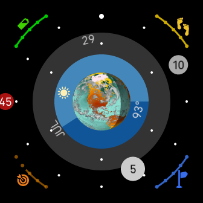

# fitbit-rings
## Analog clock with sensor info for Fitbit Versa 3 and Sense

This is an analog clock with selected sensor information, plus date and weather. Included sensors are: 
+ Battery
+ Steps
+ Distance
+ Active Zone Minutes

Battery, Steps, Distance and Active Zone sensors have status indicators on the outside corners of the clock face. Current goal percentage is reflected by the brightness of the indicator (black = 0%). Month and date are displayed on the inner rings of the clock face, with the month aligned to the hour markers, and separate markers for the day.

Current weather conditions, current temperature, and sunrise/sunset times are depicted in the center of the dial. In the center of the weather ring, a globe indicates current daylight/nighttime shadow, and current sun and moon positions. Moon phase is not shown. Be sure to select a temperature unit (C/F) in the settings to enable weather.

This clock has only been tested on Fitbit Versa 3, so please feel free to submit a pull request with any improvements or bug fixes.